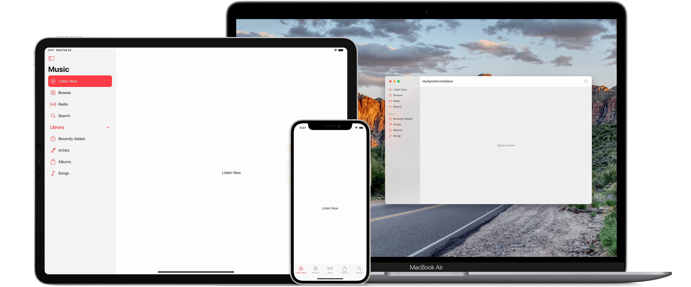

# Multiplatform Sidebar SwiftUI

This is a sample project demonstrating how to implement the new Sidebar UI for a multiplatform app (iOS, iPadOS, macOS) built with SwiftUI.

## Documentation links

- [Human Interface Guidelines for the Sidebar](https://developer.apple.com/design/human-interface-guidelines/ios/bars/sidebars/)
- [Fruta: Building a Feature-Rich App with SwiftUI](https://developer.apple.com/documentation/swiftui/fruta_building_a_feature-rich_app_with_swiftui)

## WWDC20 videos

- [Design for iPad](https://developer.apple.com/videos/play/wwdc2020/10206/)
- [What's new in SwiftUI](https://developer.apple.com/videos/play/wwdc2020/10041/)
- [Stacks, Grids, and Outlines in SwiftUI](https://developer.apple.com/videos/play/wwdc2020/10031/)
